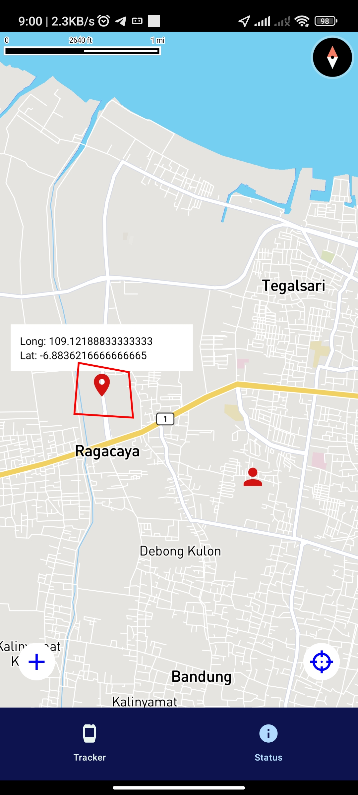
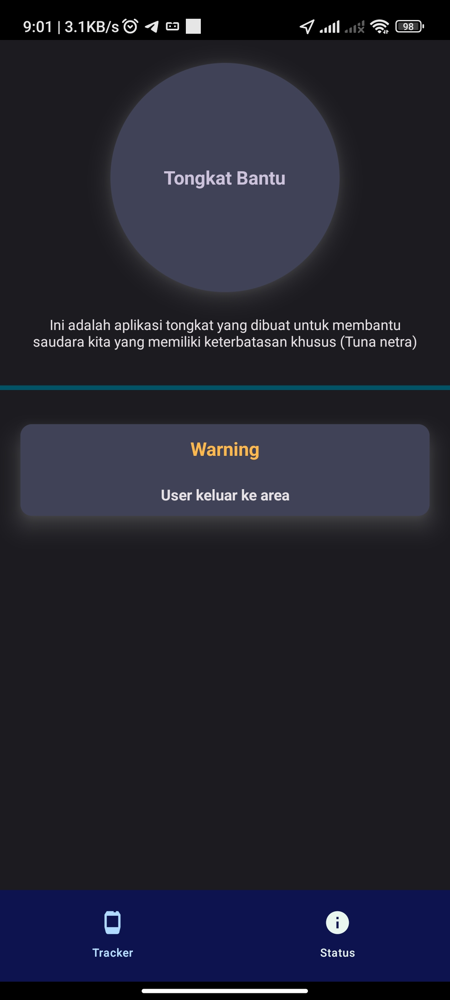
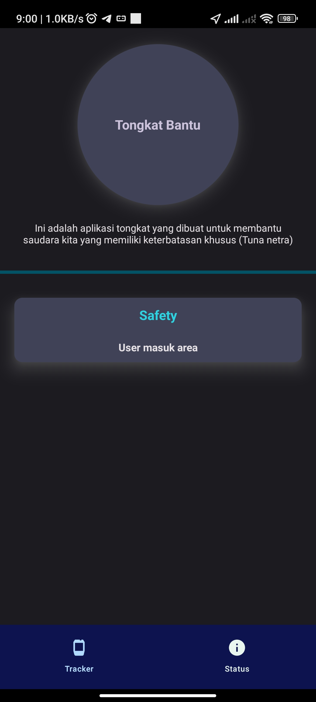

# Android App for friend disabilty

  

This app is functional for tracking the people with disability **(blind)** who currently walk. You can track when the person is in a place and when the person is out of the place. The app is connected to an Additional Devices that is **Special Stick** which already integration the system into the stick, so you can see the data in real-time.

---
#### Previews

    
    
    

---
## Requirements
|Runtime| Version |
|--|--|
| NodeJS | v18.16.0 > |
| JDK | v18.0.2 |
| Android SDK | * |
| Gradle | v7.5.1 |
---

## Guide

Before we next step, you can view the configuration environment React Native [here](https://reactnative.dev/docs/environment-setup) corresponding to your OS, then install Android Studio for the take Android SDK. Next Step, you also install Java JDK first for running the Android app. last the config, you can use [rest api](https://github.com/Aldyy123/api-tracking) to integration this android app.
If you already configured it, you can next step below to run it.

 1. `npm installl` to installation dependencies
 2. `npm start` to run the server
 3. `npm run android` to install app to your Android emulator or device

---
## Developed

**M. Ardi Trisnaldi**